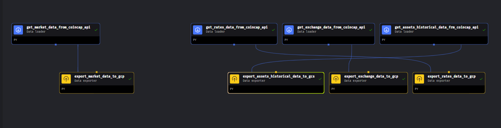
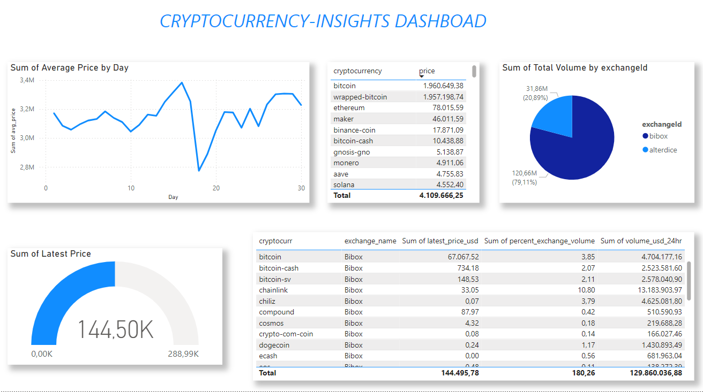

# Cryptocurrency Insights

This project aims to create an end-to-end data pipeline for ingesting, processing, and visualizing cryptocurrency data using the CoinCap API.

## Project Overview
- **Data Source**: CoinCap API
- **Processing**: Batch processing using Mage.
- **Cloud Platform**: Google Cloud Platform (GCP)
- **Data Lake**: Google Cloud Storage (GCS)
- **Data Warehouse**: Google BigQuery
- **Transformations**: dbt (Data Build Tool)
- **Visualization**: Metabase

## Getting Started
- Clone the repository
- Set up the GCP project and Terraform configuration
- Run the Mage data ingestion pipeline

## To GCS, BigQuery and Dashboard

